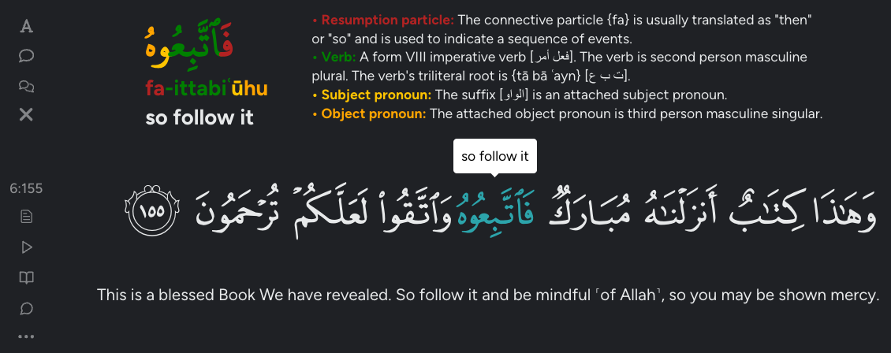

# QuranWord Insights (BETA)

This web extension enhances your experience on Quran.com by providing detailed word breakdowns, context analysis, and root word exploration with a single click of a word.

## Background

This project builds upon the Quranic Arabic Corpus, a well-known linguistic resource originally developed by Dr. Kais Dukes in 2009. In 2023, Dr. Dukes began working on Quranic Corpus 2.0, a more advanced version of the original corpus, but sadly, he passed away in 2024 before its completion. The backend of this extension is based on a modified version of the Quranic Corpus 2.0 API, re-structuring its morphological breakdown and search capabilities.

Since the future of the Corpus 2.0 remains uncertain, this project aims to continue Dr. Dukes’ legacy by making the linguistic depth of the Quran more accessible to users of Quran.com. This version is being relased as a simple quran.com web extension as a proof of concept. The files above make up a very simple web extension that calls the backend and visually displays the word breakdown when a word is clicked. This extension is currently in BETA and open for feedback from early users.

## How to Install

1.	**Download & Extract**
    - Download the code above as a `.zip` file and extract the file to a folder on your computer.
2.	**Open Web Browser Extensions Page**
    - eg. on Chrome: `chrome://extensions/` or on Edge: `edge://extensions/`.
3.	**Enable Developer Mode**
    - This allows you to load web extensions not on the official extension store (like this one).
4.	**Load the Extension**
    - Click “Load unpacked” and select the extracted folder. The extension should now appear in your extensions list. Now it's ready for use!

## How to Use

1.	**Open a Surah on Quran.com**
    - eg. https://quran.com/1 for Surah Al-Fatihah.
2.	**Click on a Quran Word**
    - A pop-up will appear above the verse for the selected word. Click buttons on the left to show more features.
3. **Explore Features**
    - *Morphology Breakdown*: See a detailed grammatical analysis of each word.
    - *Word Context and Translation*: Find the same word in different verses with context and translation.
    - *Root Word Exploration*: Discover how the root of a word is used across the Quran.
4. **Enjoy Learning!**
    - Gain a deeper understanding of Quranic words and their meanings.

## Sources
 
- [Quranic Arabic Corpus](https://corpus.quran.com) (Dr. Kais Dukes)
- [Quranic Corpus 2.0 Backend](https://github.com/kaisdukes/quranic-corpus-api) (Original API)
- [Quran.com](https://quran.com) (Primary interface for Quran text and translations)

## Feedback & Issues

Since this is a beta version, your feedback is valuable! Please report any issues or suggestions.
Thanks for trying QuranWord Insights!
